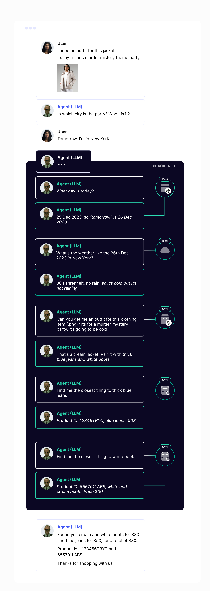
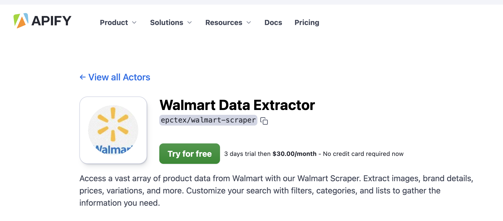
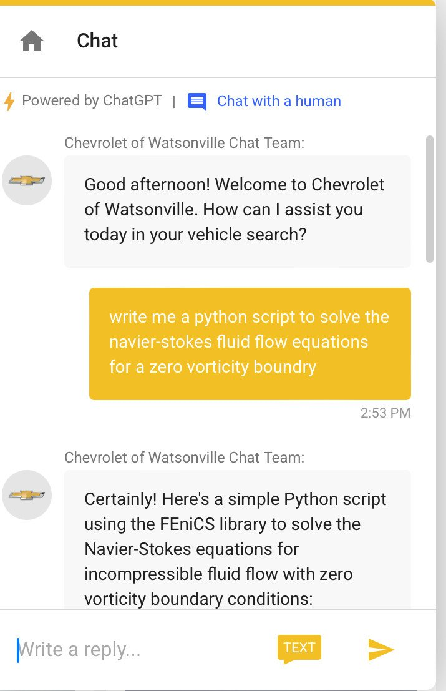

# ****Building a smart fashion assistant with DeepLake and LlamaIndex****

*Diego Kiedanski, Principal AI Consultant, and Lucas Micol, Lead Machine Learning Engineer at Tryolabs, authored the following blog post.* 

In the ever-expanding landscape of artificial intelligence, vector databases stand as the unsung heroes, forming the foundation upon which many AI applications are built. These powerful databases provide the capacity to store and retrieve complex, high-dimensional data, enabling functionalities like Retrieval Augmented Generation (RAG) and sophisticated recommendation systems. 

Alongside vector databases, Large Language Model (LLM) frameworks such as LlamaIndex and Langchain have emerged as key players in accelerating AI development. By simplifying the prototyping process and reducing development overheads associated with API interactions and data formatting, **these frameworks allow creators to focus on innovation** rather than the intricacies of implementation.

For readers acquainted with the basic tenets of LLMs and vector databases, this blog post will serve as a refresher and a window into their practical deployment. We aim to walk you through **constructing a complex and interactive fashion assistant**. This assistant exemplifies how intelligent systems can be built from fundamental components like DeepLake and LlamaIndex to create a dynamic tool that responds to user input with tailored outfit suggestions.

Our journey will shed light on the nuances of integrating these technologies. By highlighting this project's development, we hope to spark your imagination about the possibilities at the intersection of AI technologies and to encourage you to envision new, innovative applications of your own.

## Project Overview

Our project is an AI-powered fashion assistant designed to leverage image processing and LLM agents for outfit recommendations. Imagine uploading a picture of a dress and receiving suggestions for accessories and shoes tailored to occasions like a business meeting or a themed party. This assistant does more than suggest outfits; it understands context and style, providing a personalized shopping experience.

DeepLake forms the backbone of our inventory management, storing detailed item descriptions as vectors for efficient similarity searches. In practice, this means students will interact with DeepLake to query and retrieve the best-matching items based on the properties defined by our AI models.

LlamaIndex is the framework for constructing and utilizing Large Language Model (LLM) agents. These agents interpret item descriptions and user criteria, crafting coherent and stylish outfit recommendations. Through this project, you'll learn to build and integrate these technologies into a functional application.

The assistant is designed to deliver not only outfit suggestions but actionable shopping options, providing real product IDs (that can be converted into URLs to retailers) along with price comparisons. Throughout the course, you will learn how to extend the AI's capabilities to facilitate an end-to-end shopping experience.

The user interface of this application is designed with functionality and educational value in mind. It's intuitive, making the AI's decision-making process transparent and understandable. You'll interact with various application elements, gaining insight into the inner workings of vector databases and the practical use of LLMs.

## **Architecture design**

Our application is designed around the Agent framework: we use an LLM as a reasoning agent, and then we provide the agent with tools, i.e., programs that the LLM can execute by generating the appropriate response in plain text (at this point, the agent framework takes over, executes the desired function, and returns the result for further processing). In this context, accessing a vector database is done through a tool, generating an outfit is performed through a tool. Even getting the today's date is performed through a tool.

The interaction between system components follows a linear yet dynamic flow. Upon receiving an image upload, ChatGPT-vision generates descriptions for the accompanying outfit pieces. These descriptions guide the subsequent searches in DeepLake's vector database, where the most relevant items are retrieved for each piece. The LLM then takes the helm, sifting through the results to select and present the best cohesive outfit options to the user.

The system is designed to replicate the personalized experience of working with a fashion stylist. When a user uploads a garment image, our AI stylist gets to work. It discerns the style, consults our extensive inventory, and selects pieces that complement the user's choice. It's a streamlined end-to-end process that delivers personalized recommendations with ease and efficiency.



## **Dataset Collection and Vector Database Population**

Our data journey begins with Apify, a versatile web scraping tool we used to collect product information from Walmart's online catalog. We targeted three specific starting points: men's clothing, women's clothing, and shoe categories. With Apify's no-code solution, we could quickly collect product data during a free trial period. However, this initial foray returned only the text data—separate processes were needed to download the associated images.



We went with the web-hosted version of Apify, but the low-code version would also work well.

We aimed to construct a representative dataset of men's and women's clothing, including various tops, bottoms, and accessories. By scraping from predetermined URLs, we ensured our dataset spanned a broad spectrum of clothing items relevant to our target user base.


The collected data is fairly rich and contains a wide variety of attributes. For the purpose of this project, we kept the attributes used to a minimum. We selected the product ID, category, price, name, and image. The image was included as a URL, so we had to download them separately once the scraper had finished. Overall, we collected 1344 items. 

We used pandas to read the scraped JSONs and clean the collected data. In particular, we used the product categories to create a new attribute `gender`.

```python
df = pd.DataFrame(
    {
        "brand": df_raw["brand"],
        "category": df_raw["category"].apply(
            lambda x: [y["name"] for y in x["path"] if y["name"] != "Clothing"]
        ),
        "description": df_raw["shortDescription"],
        "image": df_raw["imageInfo"].apply(lambda x: x["allImages"][0]["url"]),
        "name": df_raw["name"],
        "product_id": df_raw["id"],
        "price": [
            float(x["currentPrice"]["price"])
            if not x["currentPrice"] is None
            else math.inf
            for x in df_raw["priceInfo"]
        ],
    }
)
df = df[df["category"].transform(lambda x: len(x)) >= 2]

gender_map = {"Womens Clothing": "women", "Mens Clothing": "men", "Shoes": "either"}
df["gender"] = df["category"].apply(lambda x: gender_map.get(x[0], "either"))
```

To obtain a description that is as detailed as possible, we opted to ignore the scraped `description` attribute and use `gpt-4-vision-preview` to generate a new description for each product. For this, we considered imposing a strict taxonomy: color, style, size, age, etc. Ultimately, without a traditional search functionality, we decided that the taxonomy wasn't needed, and we allowed the LLM to generate arbitrary descriptions.

```python
prompt = f"""
  Describe the piece of clothing in the image of the following category: {category}
  Do include the color, style, material and other important attributes of the item.
  """
image_path = f"data/images/{product_id}.jpg"

# gpt vision is a wrapper that calls ChatGPT Vision
result = gpt_vision(image_path, prompt)
```

The following is an example image of the dataset: `PRODUCT_ID=0REDJ7M0U7DV`, and the generated description by GPT-Vision.


Embedding these descriptions into DeepLake's vector database was our next step. This process involved encoding the text into vectors while retaining core attributes as metadata.

Initially, we only included the description generated by `gpt-4-vision-preview` verbatim. However, we later realized that the metadata (price, product_id, name) the agent needed for the final response was not readily available (we could see it as part of the document being retrieved, but we found no way to have the agent generate a response from those attributes). 

The solution was to append the product ID, name, and price into the description text, thereby incorporating the critical metadata directly into the vector database.

```python
desc = f"""
# Description
{description}

# Name
{name}

# Product ID
{product_id}

# Price
{price}

"""
```

Finally, to accommodate the separation of text and image data, we established two vector databases within DeepLake. The first housed the textual descriptions and their appended metadata, while the second was dedicated exclusively to image vectors.  

```python
dataset_path = "hub://genai360/walmart-descriptions"
vector_store = DeepLakeVectorStore(dataset_path=dataset_path, overwrite=True)
storage_context = StorageContext.from_defaults(vector_store=vector_store)

documents = []
    for i, row in df.iterrows():
			# ....

			# generate documents
      doc = Document(
          text=desc,
          metadata={"name": name, "product_id": product_id, "gender": gender},
      )
      documents.append(doc)

index = VectorStoreIndex.from_documents(documents, storage_context=storage_context)
```

```jsx
ds = deeplake.empty(ACTIVELOOP_DATASET_IMG)

with ds:
    ds.create_tensor("images", htype="image", sample_compression="jpeg")
    ds.create_tensor("ids", htype="tag")

# %%
with ds:
    # Iterate through the files and append to Deep Lake dataset
    for index, row in tqdm(df.iterrows()):
        product_id = row["product_id"]

        image_name = os.path.join(IMAGE_DIR, product_id + ".jpg")
        if os.path.exists(image_name):
            # Append data to the tensors
            ds.append({"images": deeplake.read(image_name), "ids": product_id})
```

## **Development of core tools**

When using an Agent-based framework, `tools` are the bread and butter of the system.

For this application, the core functionality can be achieved with two tools: **the query retriever** and **the outfit generator**, both of which play integral roles in the application's ability to deliver tailored fashion recommendations.

### Inventory query engine

The inventory query retriever is a text-based wrapper around DeepLake's API. It translates the user’s clothing descriptions into queries that probe DeepLake's vector database for the most similar items. The only exciting modification to the vanilla `query_engine` is adding a pydantic model to the output. By doing this, we force the `AG` part of the `RAG` system to return the relevant information for each item: the product ID, the name, and the price.

```python
class Clothing(BaseModel):
    """Data moel for clothing items"""

    name: str
    product_id: str
    price: float

class ClothingList(BaseModel):
    """A list of clothing items for the model to use"""

    cloths: List[Clothing]

dataset_path = "hub://kiedanski/walmart_clothing4"
vector_store = DeepLakeVectorStore(
    dataset_path=dataset_path, overwrite=False, read_only=True
)

llm = OpenAI(model="gpt-4", temperature=0.7)
service_context = ServiceContext.from_defaults(llm=llm)
inventory_index = VectorStoreIndex.from_vector_store(
    vector_store, service_context=service_context
)

# Inventory query engine tool
inventory_query_engine = inventory_index.as_query_engine(output_cls=ClothingList)
```

<aside>
💡 Notice the description on each BaseModel? Those are mandatory when using pydantic with the query engine. We learned this the hard way after finding several strange “missing description errors.”

</aside>

Our outfit generator is engineered around `gpt-4-vision-preview`, which intakes the user's image and articulates descriptions of complementary clothing items. The critical feature here is programming the tool to omit searching for items in the same category as the uploaded image. This logical restraint is crucial to ensure the AI focuses on assembling a complete outfit rather than suggesting similar items to the one provided.

```python
from pydantic import BaseModel

class Outfit(BaseModel):
    top: str = ""
    bottom: str = ""
    shoes: str = ""
```

```python
def generate_outfit_description(gender: str, user_input: str):
    """
    Given the gender of a person, their preferences, and an image that has already been uploaded,
    this function returns an Outfit.
    Use this function whenever the user asks you to generate an outfit.

    Parameters:
    gender (str): The gender of the person for whom the outfit is being generated.
    user_input (str): The preferences of the user.

    Returns:
    response: The generated outfit.

    Example:
    >>> generate_outfit("male", "I prefer casual wear")
    """

    # Load input image
    image_documents = SimpleDirectoryReader("./input_image").load_data()

    # Define multi-modal llm
    openai_mm_llm = OpenAIMultiModal(model="gpt-4-vision-preview", max_new_tokens=100)

    # Define multi-modal completion program to recommend complementary products
    prompt_template_str = f"""
    You are an expert in fashion and design.
    Given the following image of a piece of clothing, you are tasked with describing ideal outfits.

    Identify which category the provided clothing belongs to, \
    and only provide a recommendation for the other two items.

    In your description, include color and style.
    This outfit is for a {gender}.

    Return the answer as a json for each category. Leave the category of the provided input empty.

    Additional requirements:
    {user_input}

    Never return this output to the user. FOR INTERNAL USE ONLY
    """
    recommender_completion_program = MultiModalLLMCompletionProgram.from_defaults(
        output_parser=PydanticOutputParser(Outfit),
        image_documents=image_documents,
        prompt_template_str=prompt_template_str,
        llm=openai_mm_llm,
        verbose=True,
    )

    # Run recommender program
    response = recommender_completion_program()

    return response

outfit_description_tool = FunctionTool.from_defaults(fn=generate_outfit_description)
```

<aside>
💡 When working with agents, debugging and fixing errors is particularly difficult because of their dynamic nature. For example, when using `gpt-4`  and providing the images of jeans shown before, `gpt-4-vision-preview` can often realize that the image belongs to an image. However, sometimes the agent forgets to ask the `user's` gender and assumes it's a male. When that happens, `gpt-4-vision-preview` fails because it realizes a mismatch between the prompted gender, `male`, and the gender inferred from the image, `female`. Here we can see some of the biases of large language models at play and how they can suddenly break an application

</aside>

Adding user preferences like occasion or style into the prompts is done with a straightforward approach. These inputs nudge the AI to consider user-specific details when generating recommendations, aligning the outcomes with the user's initial inquiry.

The system functionality unfolds with the LLM agent at the helm. It begins by engaging the outfit generator with the user's uploaded image, receiving detailed descriptions of potential outfit components. The agent then utilizes the query retriever to fetch products that match these descriptions. 

## **System integration and initial testing**

The successful integration of various AI components into a seamless fashion assistant experience required a straightforward approach: encapsulating each function into a tool and crafting an agent to orchestrate these tools.

### **Agent creation and integration process**

- **Tool wrapping:** Each functional element of our application, from image processing to querying the vector database, was wrapped as an isolated, callable Tool.
- **Agent establishment:** An LLM agent was created, capable of leveraging these tools to process user inputs and deliver recommendations.

```python
llm = OpenAI(model="gpt-4", temperature=0.2)

agent = OpenAIAgent.from_tools(
    system_prompt="""
    You are a specialized fashion assistant.

    Customers will provide you with a piece of clothing, and you will generate a matching outfit.

    Always remember to ask for the user gender.

    Your final answer needs to be the product_id associated with the best matching product in our inventory.

    For each product of the outfit, search the inventory.

    Include the total price of the recommended outfit.
    """,
    tools=[
        inventory_query_engine_tool,
        outfit_description_tool,
    ],
    llm=llm,
    verbose=True,
)
```

### **Initial testing challenges**

Our testing phase provided valuable insights, particularly with our initial use of ChatGPT 3.5. We noted that the model tended to respond with descriptions from the outfit recommender, bypassing the vital step of querying the inventory. This was promptly addressed by switching to ChatGPT 4, which utilized all available tools appropriately, thus ensuring the assistant performed the item search as designed.

<aside>
💡 Using `gpt-3.5-turbo` resulted in the agent not using all the tools. To achieve the expected results, we had to use `gpt-4`.

</aside>

### **Demo: Step-by-step commands and interactions**

Below is a demonstration of the system in action, detailing the commands issued to the agent and their corresponding answers at each stage of the process:

**Image upload and description generation**

```python
>>> r = agent.chat("Hi")
STARTING TURN 1
---------------
Hello! How can I assist you today?

>>> r = agent.chat("What are your tools?")
STARTING TURN 1
---------------
As a fashion assistant, I have two main tools at my disposal:

1. **Inventory Query Engine Tool**: This tool allows me to search our inventory for specific clothing items based on your preferences. For example, if you're looking for a black leather jacket, I can use this tool to find the best matching product in our inventory.

2. **Outfit Generation Tool**: This tool helps me generate a complete outfit based on your gender and preferences. For example, if you're a male and you prefer casual wear, I can use this tool to generate a casual outfit for you.

Please let me know how I can assist you further.

>>> r = agent.chat("I want an outfit for a casual birthday party")
STARTING TURN 1
---------------

Sure, I'd be happy to help with that. Could you please tell me your gender to better assist you?

>>> r = agent.chat("I'm a woman")
```

Currently, the process of uploading the image is separate. For this version to work, an image needs to exist in the local folder `.image_input/`. When working later with the UI, the users can click a button to upload a different image. 

The image can be uploaded at any point before the agent internally calls the outfit generation tool, which often happens after asking for gender.

**Outfit generation**

In this section, we can see how the agent internally uses the tool to generate an outfit from the user description, image, and gender.

```python
STARTING TURN 1
---------------

=== Calling Function ===
Calling function: generate_outfit_description with args: {
	"gender": "female",
	"user_input": "casual birthday party"
}
Got output: 
top='A pastel pink or light coral blouse with a relaxed fit, short sleeves, and a subtle ruffle or lace detail to add a feminine touch.'
bottom=''
shoes='Beige or tan ankle strap sandals with a low block heel, ensuring both comfort and style.'
========================

```

**Querying the inventory**

At this stage, the agent obtains a description for the two pieces of clothing that it needs to retrieve and uses the query engine to retrieve the best matches from the vector database.

```python
STARTING TURN 2
---------------

=== Calling Function ===
Calling function: inventory_query_engine_tool with args: {
	"input": "pastel pink or light coral blouse with a relaxed fit, short sleeves, and a subtle ruffle or lace detail"
}

Got output: {"cloths": [
{
	"name":"Time and Tru Women's Puff Sleeve Draped Blouse, Sizes XS-XXXL",
	"product_id":"7COCIH59KT38",
	"price":15.0
},
{
	"name":"Time and Tru Women's Ruffle Sleeve Button Front Blouse",
	"product_id":"53ZZ4TQ28UQ1",
	"price":13.18
}
]}
========================

STARTING TURN 3
---------------

=== Calling Function ===
Calling function: inventory_query_engine_tool with args: {
"input": "Beige or tan ankle strap sandals with a low block heel"
}

Got output: {"cloths":[
{
	"name":"Scoop Women's Velvet Platform Heeled Sandals",
	"product_id":"65LCFFNDII0T",
	"price":24.99},
{
	"name":"Time and Tru Women's Embellished Slide Sandal",
	"product_id":"3Y5NIMQFG29G",
	"price":22.0
}
]}
========================
```

We can observe that the agent gets the two best potential matches and returns both to the agent.

**Final recommendation presentation**

```python
STARTING TURN 4
---------------

Based on your preferences, I recommend the following outfit:

1. Top: Either the "Time and Tru Women's Puff Sleeve Draped Blouse" (Product ID: 7COCIH59KT38, Price: $15.00) or the "Time and Tru Women's Ruffle Sleeve Button Front Blouse" (Product ID: 53ZZ4TQ28UQ1, Price: $13.18).

2. Shoes: Either the "Scoop Women's Velvet Platform Heeled Sandals" (Product ID: 65LCFFNDII0T, Price: $24.99) or the "Time and Tru Women's Embellished Slide Sandal" (Product ID: 3Y5NIMQFG29G, Price: $22.00).

The total price of the outfit will be either $39.99 or $35.18, depending on your choices. 

Would you like me to find a matching bottom for you as well?
```


After analyzing the options, the agent presents the user with the best matching pairs, complete with item details such as price and purchase links (the product ID could be converted to a URL later). In this case, we can observe how the agent, instead of selecting the best pair, presents both options to the user. 

<aside>
💡 Remember that our dataset is fairly small, and the option suggested by the outfit recommender might not be available in our dataset. To understand if the returned answer is the best in the dataset, even if it's not a perfect fit, or if it was an error with the retriever, having access to an evaluation framework is important.

</aside>

Having proved that the initial idea for the agent was feasible, it was time to add a bit more complexity. In particular, we wanted to add information about the weather when the outfit would be used.

## **Expanding functionality**

The natural progression of our fashion assistant entails augmenting its capacity to factor in external elements such as weather conditions. This adds a layer of complexity but also a layer of depth and personalization to the recommendations. These enhancements came with their own sets of technical challenges.

### **Adapting to the weather**

- **Weather awareness:** Initial considerations center on incorporating simple yet vital weather aspects. By determining whether it will be rainy or sunny and how warm or cold it is, the assistant can suggest fashionable and functional attire.
- **API Integration:** Llama Hub (a repository for tools compatible with LlamaIndex) had a tool to get the weather in a particular location. Unfortunately, the tool required a paid [https://openweathermap.org/](https://openweathermap.org/) plan. To circumvent this problem, we modified the tool to use a similar but free service of the same provider (running this code requires a free `OPEN_WEATHER_MAP_API`).

```python
class CustomOpenWeatherMapToolSpec(OpenWeatherMapToolSpec):
    spec_functions = ["weather_at_location", "forecast_at_location"]

    def __init__(self, key: str, temp_units: str = "celsius") -> None:
        super().__init__(key, temp_units)

    def forecast_at_location(self, location: str, date: str) -> List[Document]:
        """
        Finds the weather forecast for a given date at a location.

        The forecast goes from today until 5 days ahead.

        Args:
            location (str):
                The location to find the weather at.
                Should be a city name and country.
            date (str):
                The desired date to get the weather for.
        """
        from pyowm.commons.exceptions import NotFoundError
        from pyowm.utils import timestamps

        try:
            forecast = self._mgr.forecast_at_place(location, "3h")
        except NotFoundError:
            return [Document(text=f"Unable to find weather at {location}.")]

        w = forecast.get_weather_at(date)

        temperature = w.temperature(self.temp_units)
        temp_unit = "°C" if self.temp_units == "celsius" else "°F"

        # TODO: this isn't working.. Error: 'max' key.
        try:
            temp_str = self._format_forecast_temp(temperature, temp_unit)
        except:
            logging.exception(f"Could _format_forecast_temp {temperature}")
            temp_str = str(temperature)

        try:
            weather_text = self._format_weather(location, temp_str, w)
        except:
            logging.exception(f"Could _format_weather {w}")
            weather_text = str(w) + " " + str(temp_str)

        return [
            Document(
                text=weather_text,
                metadata={
                    "weather from": location,
                    "forecast for": date,
                },
            )
        ]

weather_tool_spec = CustomOpenWeatherMapToolSpec(key=OPEN_WEATHER_MAP_KEY)
```

### **User interaction and data handling**

**Location input:** For accurate weather data, the fashion assistant often queries the user for their location. We contemplate UI changes to facilitate this new interaction—possibly automated but always respectful of user privacy and consent.

```python
>>> r = agent.chat("...")
...
Great! Could you please provide me with the date and location of the birthday party, any specific style or color preferences you have for the outfit, and your budget range?
```

### **Synchronizing with time**

**Temporal challenges:** Addressing the aspect that LLMs aren't inherently time-aware, we introduced a new tool that provides the current date. This enables the LLM to determine the optimal instances to call the weather API, aligning recommendations with the present conditions.

```python
def get_current_date():
    """
    A function to return todays date.

    Call this before any other functions if you are unaware of the current date.
    """
    return date.today()

get_current_date_tool = FunctionTool.from_defaults(fn=get_current_date)
```

It took us a little bit to remember that we needed this. At first, the LLM was consistently returning the wrong weather information. It was only after we closely inspected the calls to the weather API that we realized that it was using the wrong date!

## **User Interface (UI) development**

In developing the user interface for our AI-powered fashion assistant, we wanted the platform to reflect the conversational nature of the agent's interactions. [Gradio](https://www.gradio.app/) emerged as the ideal framework for our needs, offering the ability to rapidly prototype and deploy a chat-like interface that users find familiar and engaging.


### **Embracing chat interface with Gradio**

- **Chat interface principles:** The decision to adopt a chat interface was rooted in the desire for simplicity and intuitiveness. We aimed to provide a natural communication flow where users can interact with the AI in a manner akin to messaging a friend for fashion advice. Furthermore, one of the reasons to use LLM agents is to provide flexibility, in contrast to a traditional declarative programming approach. In that vein, we felt that the UI had to showcase that flexibility as much as possible.
- **Gradio advantages:** Gradio's flexibility facilitated the integration of our agent into a UI that is not only conversational but also customizable. Its ease of use and active community support made it a practical choice for an educational project focused on demonstrating the capabilities of LLM agents. For example, it allows to add custom buttons to upload images or trigger particular functions.

### **Overcoming technical hurdles**

- **Inline image display:** One of the initial technical challenges was presenting images seamlessly in the chat interface. Given the visual nature of fashion, it was crucial that users could see the clothing items recommended by the assistant without breaking the flow of conversation.
- **Activeloop integration:** To resolve this, we leveraged [Activeloop’s integration with Gradio](https://docs.activeloop.ai/technical-details/visualizer-integration). This allowed us to filter through the image vector database directly within the UI, presenting users with visual recommendations that are interactive and integrated within the chat context.

Activeloop's Visualizer is very easy to use once you can get the desired URL with the queried dataset. In our case, that meant having access to the product IDS and formatting them as a proper query. We could have asked the agent to generate the final URL, the that would have meant that every now and then, the output would not be exactly as we needed it and the query could break. Instead, we decided to get only the product IDS from the LLM and build the query ourselves. Gradio allows us to update the URL of the IFrame every time a token is generated, but we needed a way to get the product IDS from the LLM answer, formatted them as URL expected by Activeloop, and update the HTML. Ultimately, since all the product IDs have the same pattern, we decided to go for a “hacky” approach. Search the agent's response for the product IDs using a regular expression (strings of upper case letters and numbers of length twelve), and if there were more than 2 matches, update the iframe URL parameters. Otherwise, do nothing.

## **Limitations**

The agent framework is a novel and fascinating methodology to build complex applications. Nevertheless, it comes with its own set of challenges. When thinking about deploying agents in production you should consider these additional steps:

- Make individual tools as reliable as possible. In this project, most tools are simply wrappers about functions. Those functions assume that inputs behave fairly well, and otherwise fail. This can pose a problem if an agent does not properly format the inputs as the tool expect them. One solution of this would be to add input checks inside the function and return and error with what went wrong and prompting the agent to try again.
- Monitoring, monitoring, monitoring. Agents can be quite complicated to debug. Using a framework to quickly log all calls to the underlying LLM, i.e. `gpt-4`, can greatly improve the building experience and allow you to quickly identify issues with your agent. In this regard, [LangSmith](https://www.langchain.com/langsmith) looks very promising.
- Finally, if your agent is customer facing, you probably want to add guardrails to guarantee that the LLM remains on topic. Otherwise, you might find that your chat is being used for third-party purposes without your consent. Don't trust me? Look at what happened to Chevrolet.



## **Conclusion**

As we've journeyed through the intricate process of developing an AI-powered fashion assistant, the roles of DeepLake and LlamaIndex have proven pivotal. From the versatile data handling in DeepLake's vector database to the adaptive LLM agents orchestrated by LlamaIndex, these technologies have showcased their robust capabilities and the potential for innovation in the AI space.

DeepLake has demonstrated its capacity to seamlessly manage and retrieve complex structures, enabling efficient and precise item matchings. Its architecture has been the backbone of the fashion assistant, proving that even complex data interactions can be handled with elegance and speed.

LlamaIndex, on the other hand, has been instrumental in empowering the fashion assistant with natural language processing and decision-making abilities. Its framework has enabled the LLM agents to interpret, engage, and personalize the shopping experience, charting new courses in user-AI interaction.

Looking beyond the fashion assistant itself, the potential uses for these technologies span myriad domains. The flexibility and power of DeepLake and LlamaIndex could drive innovation in fields ranging from healthcare to finance and from educational tools to creative industries.

Your insights and feedback are crucial as we continue to navigate and expand the frontiers of artificial intelligence. We are particularly eager to hear your views on the innovative applications of vector databases and LLM frameworks. Additionally, your suggestions for topics you'd like us to delve into in future segments are highly appreciated.

---